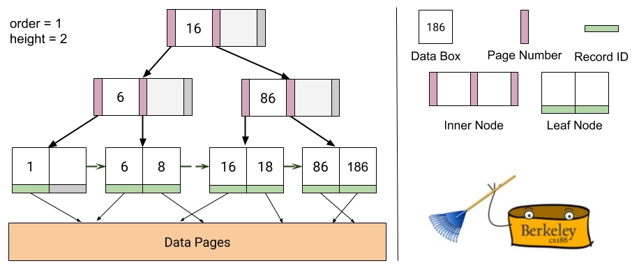
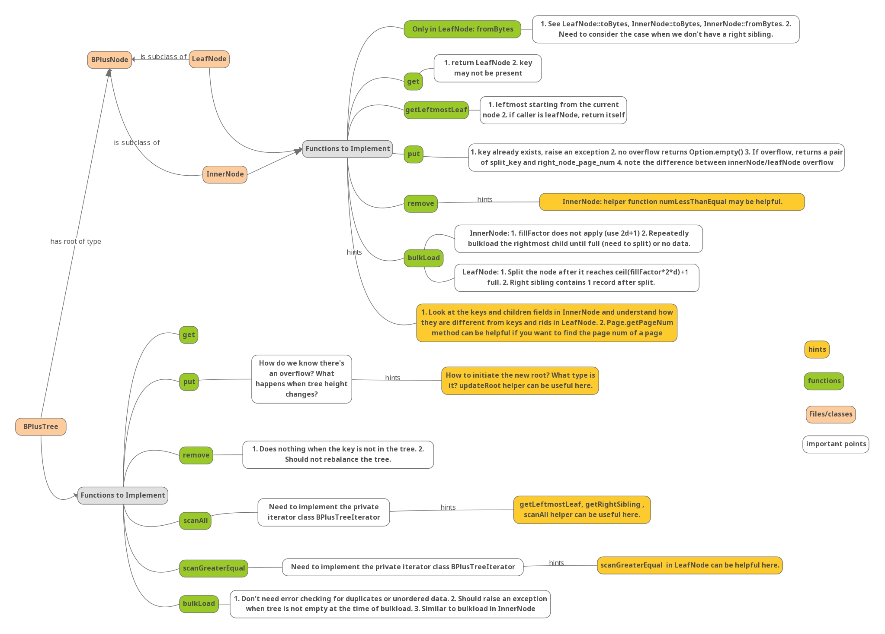

# Your Tasks



In this project you'll be implementing B+ tree indices. Since you'll be diving into the code base for the first time we've provided an introduction to the existing skeleton code.

## Understanding the Skeleton Code

### DataBox

Every modern database supports a variety of data types to use in records, and MOOCBase is no exception. For consistency and convenience most implementations choose to have their own internal representation of their data types built on top of the implementation language's defaults. In MOOCBase we represent them using data boxes.

A data box can contain data of the following types: `Boolean` \(1 byte\), `Int` \(4 bytes\), `Float` \(4 bytes\), `Long` \(8 bytes\) and `String(N)` \(N bytes\). For this project you'll be working with the abstract [`DataBox`](https://github.com/berkeley-cs186/fa20-moocbase/blob/master/src/main/java/edu/berkeley/cs186/database/databox/DataBox.java) class which implements `Comparable<DataBox>`. You may find it useful to review how the [Comparable interface works](https://docs.oracle.com/javase/8/docs/api/java/lang/Comparable.html) for this project.

### RecordId

A record in a table is uniquely identified by its page number \(the number of the page on which it resides\) and its entry number \(the record's index on the page\). These two numbers \(pageNum, entryNum\) comprise a [`RecordId`](https://github.com/berkeley-cs186/fa20-moocbase/blob/master/src/main/java/edu/berkeley/cs186/database/table/RecordId.java). For this project we'll be using record IDs in our leaf nodes as pointers to records in the data pages.

### Index

The [`index`](https://github.com/berkeley-cs186/fa20-moocbase/tree/master/src/test/java/edu/berkeley/cs186/database/index%20) directory contains a partial implementation of an Alternative 2 B+ tree, an implementation that you will complete in this project. Some of the important files in this directory are:

* [`BPlusTree.java`](https://github.com/berkeley-cs186/fa20-moocbase/blob/master/src/main/java/edu/berkeley/cs186/database/index/BPlusTree.java) - This file contains the class that manages the structure of the B+ tree. Every B+ tree maps keys of a type `DataBox` \(a single value or "cell" in a table\) to values of type `RecordId` \(identifiers for records on data pages\). An example of inserting and a retrieving records using keys can be found in the comments at [`@BPlusTree.java#L12`](https://github.com/berkeley-cs186/fa20-moocbase/blob/master/src/main/java/edu/berkeley/cs186/database/index/BPlusTree.java#L124)
* [`BPlusNode.java`](https://github.com/berkeley-cs186/fa20-moocbase/blob/master/src/main/java/edu/berkeley/cs186/database/index/BPlusNode.java) - A B+ node represents a node in the B+ tree, and contains similar methods to `BPlusTree` such as `get`, `put` and `delete`. `BPlusNode` is an abstract class and is implemented as either a `LeafNode` or an `InnerNo`
* * [`LeafNode.java`](https://github.com/berkeley-cs186/fa20-moocbase/blob/master/src/main/java/edu/berkeley/cs186/database/index/LeafNode.java) - A leaf node is a node with no descendants that contains pairs of keys and Record IDs that point to the relevant records in the table, as well a pointer to its right sibling. More details can be found [`@LeafNode.java#L15`](https://github.com/berkeley-cs186/fa20-moocbase/blob/master/src/main/java/edu/berkeley/cs186/database/index/LeafNode.java#L15)
  * [`InnerNode.java`](https://github.com/berkeley-cs186/fa20-moocbase/blob/master/src/main/java/edu/berkeley/cs186/database/index/InnerNode.java) - An inner node is a node that stores keys and pointers \(page numbers\) to child nodes \(which themselves may either be an inner node or a leaf node\). More details can be found [`@InnerNode.java#L15`](https://github.com/berkeley-cs186/fa20-moocbase/blob/master/src/main/java/edu/berkeley/cs186/database/index/InnerNode.java#L15)
* [`BPlusTreeMetadata.java`](https://github.com/berkeley-cs186/fa20-moocbase/blob/master/src/main/java/edu/berkeley/cs186/database/index/BPlusTreeMetadata.java)- This file contains a class that stores useful information such as the order and height of the tree. You can access instances of this class using the `this.metadata` instance variables available in all of the classes listed above.

#### Implementation Details

You should read through all of the code in the [`index`](https://github.com/berkeley-cs186/fa20-moocbase/tree/master/src/main/java/edu/berkeley/cs186/database/index) directory. Many comments contain critical information on how you must implement certain functions. For example, `BPlusNode::put` specifies how to redistribute entries after a split. You are responsible for reading these comments. Here are a few of the most notable points:

* Our implementation of B+ trees **does not** support duplicate keys. You will throw an exception whenever a duplicate key is inserted.
* Our implementation of B+ trees assumes that inner nodes and leaf nodes can be serialized on a single page. You **do not** have to support nodes that span multiple pages.
* Our implementation of delete **does not** rebalance the tree. Thus, the invariant that all non-root leaf nodes in a B+ tree of order `d` contain between `d` and `2d` entries is broken. Note that actual B+ trees **do rebalance** after deletion, but we will **not** be implementing rebalancing trees in this project for the sake of simplicity.

### LockContext objects

There are a few parts in this project where a method will take in objects of the type `LockContext`. You do not need to worry too much about these objects right now; they will become more relevant in Project 4.

If there are any methods you wish to call that require these objects, use the ones passed in to the method you are implementing, or defined in the class of the method you are implementing \(`this.lockContext` for `BPlusTree` and `this.treeContext` for `InnerNode` and `LeafNode`\).

### Optional&lt;T&gt; objects

This part of the project makes extensive use of `Optional<T>` objects. We recommend reading through the documentation [here](https://docs.oracle.com/javase/8/docs/api/java/util/Optional.html) to get a feel for them. In particular, we use `Optional`s for values that may not necessarily be present. For example, a call to `get` may not yield any value for a key that doesn't correspond to a record, in which case an `Optional.empty()` would be returned. If the key did correspond to a record, a populated `Optional.of(RecordId(pageNum, entryNum))` would be returned instead.

### Project Structure Diagram

Here's a diagram that shows the structure of the project with color-coded components. You may find it helpful to refer back to this after you start working on the tasks.



* Green Boxes: functions that you need to implement
* White boxes: next to each function, contains a quick summary of the important points that you need to consider for that function. **To find more detailed descriptions look at the comments of each method**. 
* Orange boxes: hints for each function which may point you to helper functions.

## Your Tasks

### Task 1: LeafNode::fromBytes

You should first implement the `fromBytes` in `LeafNode`. This method reads a `LeafNode` from a page. For information on how a leaf node is serialized, see `LeafNode::toBytes`. For an example on how to read a node from disk, see `InnerNode::fromBytes`. Your code should be similar to the inner node version but should account for the differences between how inner nodes and leaf nodes are serialized. You may find the documentation in [`ByteBuffer.java`](https://github.com/berkeley-cs186/fa20-moocbase/blob/master/src/main/java/edu/berkeley/cs186/database/common/ByteBuffer.java#L5) helpful.

Once you have implemented `fromBytes` you should be passing `TestLeafNode::testToAndFromBytes`.

### Task 2: get, getLeftmostLeaf, put, remove

After implementing `fromBytes`, you will need to implement the following methods in `LeafNode`, `InnerNode`, and `BPlusTree`:

* `get`
* `getLeftmostLeaf` \(`LeafNode` and `InnerNode` only\)
* `put`
* `remove`

For more information on what these methods should do refer to the comments in `BPlusTree` and `BPlusNode`.

Each of these methods, although split into three different classes, can be viewed as one recursive action each - the `BPlusTree` method starts the call, the `InnerNode` method is the recursive case, and the `LeafNode` method is the base case. It's suggested that you work on one method at a time \(over all three classes\).

We've provided a `sync()` method in `LeafNode` and `InnerNode`. The purpose of `sync()` is to ensure that representation of a node in our buffers is up-to-date with the representation of the node in program memory. **Do not forget to call `sync()` when implementing the two mutating methods** \(`put` and `remove`\); it's easy to forget.

### Task 3: Scans

You will need to implement the following methods in `BPlusTree`:

* `scanAll`
* `scanGreaterEqual`

In order to implement these, you will have to complete the [`BPlusTreeIterator`](https://github.com/berkeley-cs186/fa20-moocbase/blob/master/src/main/java/edu/berkeley/cs186/database/index/BPlusTree.java#L396) inner class in `BPlusTree.java`to complete these two methods. 

After completing this Task you should be passing `TestBPlusTree::testRandomPuts`

### Task 4: Bulk Load

Much like the methods from the Task 2 you'll need to implement `bulkLoad` within all three of `LeafNode`, `InnerNode`, and `BPlusTree`. Since bulk loading is a mutating operation you will need to call `sync()`. Be sure to read the instructions in [`BPluNode::bulkLoad`](https://github.com/berkeley-cs186/fa20-moocbase/blob/master/src/main/java/edu/berkeley/cs186/database/index/BPlusNode.java#L139) carefully to ensure you split your nodes properly. We've provided a visualization of bulk loading for an order 2 tree with fill factor 0.75 \([powerpoint slides here](https://docs.google.com/presentation/d/1_ghdp60NV6XRHnutFAL20k2no6tr2PosXGokYtR8WwU/edit?usp=sharing)\):


After this you should pass all the Project 2 tests we have provided to you \(and any you add yourselves\). These are all the provided tests in [`database.index.*`](https://github.com/berkeley-cs186/fa20-moocbase/tree/master/src/test/java/edu/berkeley/cs186/database/index).

## Debugging

To help you debug we have implemented the `toDotPDFFile` method of `BPlusTree`. You can add a call to this method in a test to generate a PDF file of your B+ tree.

For example,

```java
BPlusTree tree = ...
tree.toDotPDFFile("tree.pdf");
```

If you get `"Cannot run program "dot"`you need to install [GraphViz](https://graphviz.gitlab.io/download/). GraphViz is a software package that generates visualizations of network style graphs.

## You're done!

Move on to the next sections for details on testing and on submitting the assignment.

